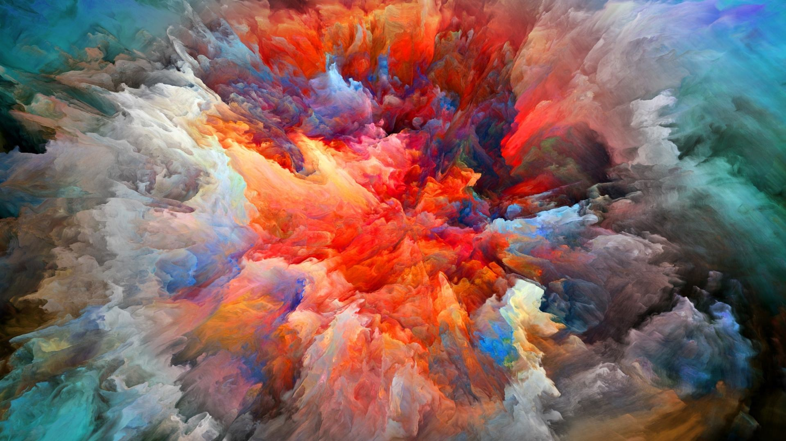
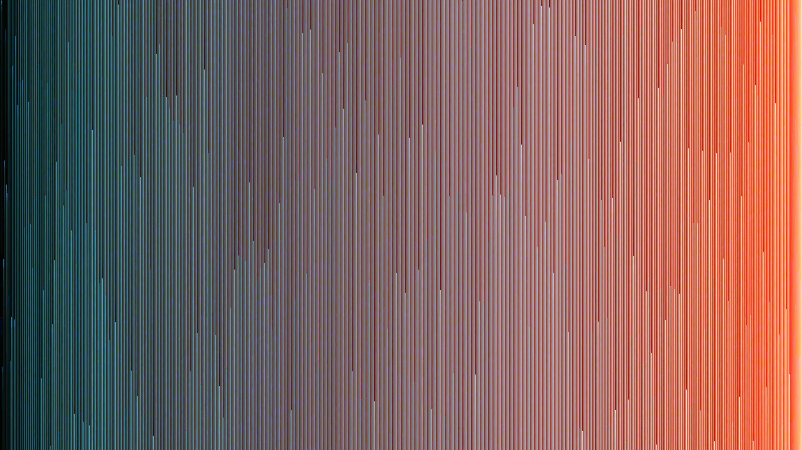
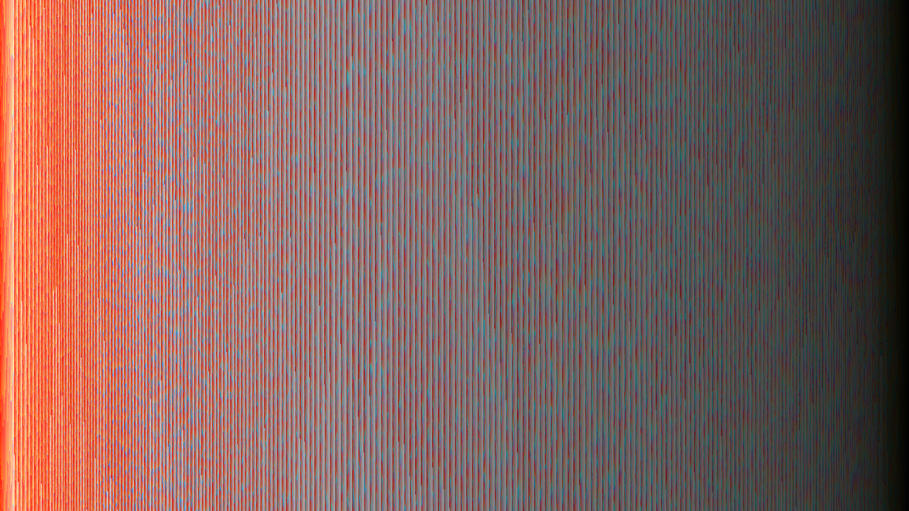

# PixelSort
PixelSort is Java Library for sorting the pixels of image in ways that amuse me.
Part of the project is about testing efficiency of some data algorithms.
There is a GUI for easy testing/trying out different pictures.

## Installation
Set up a Java Development environment of your choice, then download library and reference it.

## Usage
You can used the included GUI\
or
```Java
    PixelSort sort = new RGBArraySort(file);
    sort.sort();
    sort.print(); //Prints the image as a png and then returns the file location 
    or
    sort.getSortedImage(); //Returns Buffered Image
```
The sorted image will be saved to the same file location as the selected image, but with a longer name.

## Example Images

Unsorted Scenic


Default RGB Array sort


HSB Merge Sort it has some logic to try to do a better job sorting.


Unsorted Color Explosion


Default RGB Array sort


HSB Merge Sort it has some logic to try to do a better job sorting,
though it seems to have failed in this instance.

